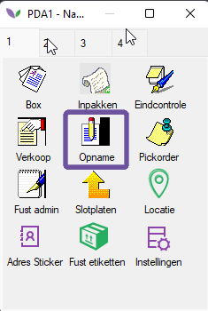
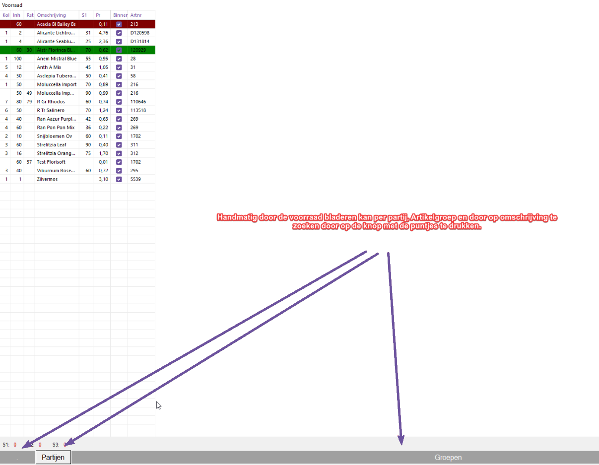
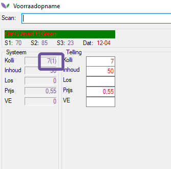

# Voorraadcontrole
-----

Met de module voorraadcontrole op PDA kun je heel makkelijk door de voorraad lopen en middels een simpele scan controleren of het aantal dat je fysiek in de cel hebt staan overeenkomt met het aantal dat in Florisoft in je voorraad staat.
Het scannen en controleren van de partijen doen we normaal met een PDA.
 
Ook is het handig als er van te voren al verkopers zijn aangemaakt ( Constanten --> Organen --> verkopersgegevens --> Verkopers ) voordat je de voorraad gaat controleren moet je namelijk eerst je verkoperscode invullen. Hierdoor is altijd terug te zien wie een partij heeft gewijzigd in geval van verschillen. Ook moet er, mocht dit nog niet het geval zijn, een barcode ( met de cVar15 ) op de sticker op de voorraadpartijen aanwezig zijn.

<b>Klik hier voor het voorbeeld</b>

 

Vervolgens scannen we een sticker op een partij in de koelcel om deze te openen, hierin zien we het huidige aantal in de voorraad en kunnen we deze aanpassen wanneer dit aantal niet overeenkomt met het huidige aantal van de partij in de koelcel. (onderstaand screenshot is een PDA gebruiker op een desktop pc, op PDA zal dit scherm het zelfde zijn maar compacter)

<b>Klik hier voor het voorbeeld</b>

<b>Klik hier voor het voorbeeld</b>

Nadat de partij gecontroleerd is zal deze in het opname scherm groen zijn.

<b>Klik hier voor het voorbeeld</b>

 
Wanneer er actieve pickorders op een partij zijn, dan zie je dat terug in het voorraadopname scherm. 
Hieronder zie je tussen haakjes dat er (1) kolli actief is in de pickorders.

<b>Klik hier voor het voorbeeld</b>

 
Ook in de backoffice kun je dit terugzien wanneer je de voorraadopname activeert. Op deze manier zou je naderhand ook vanaf een normale gebruiker in de voorraad kunnen zien of alle partijen in de voorraad zijn gecontroleerd.

<b>Klik hier voor het voorbeeld</b>

<b>Klik hier voor het voorbeeld</b>

<b>Klik hier voor het voorbeeld</b>

Na het controleren van een partij kun je er ook voor kiezen om een nieuwe prijssticker voor de partij te printen mocht dit nodig zijn. Je kunt ook gewoon meteen de volgende partij scannen.
 
Wanneer er bij tellen een voorraadverschil wordt ontdekt kan de gebruiker dit dus meteen aanpassen zodat de voorraad weer klopt. Middels FS_kassa of systeem instelling VOORRAADOPNAMEDEBNR kunnen we een debiteur aangeven waar de verschillen naartoe moeten worden geboekt. Bij een verschil zal dit een verdeling naar deze debiteur opleveren die dan uiteindelijk ook in een factuur terecht zal komen. Op deze manier is er nog inzicht in de voorraadverschillen.