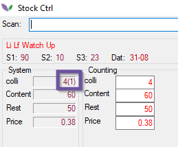

# Florisoft Manual Stock control - M43

With the stock control module on PDA you can easily walk through the stock and use a simple scan to check whether the amount you physically have in the cell corresponds to the amount in your stock in Florisoft.
We normally scan and check the games on a PDA, this can also be done from a normal user, but that is not recommended.
 
It is also useful if sellers have already been created in advance (Constants --> Organs --> seller data --> Sellers) before you check the stock, you must first enter your seller code. This means that it is always possible to see who has changed a lot in case of differences.
If this is not yet the case, there must also be a barcode (with the cVar15) on the sticker on the stock lots.

<b>Click here from the example image</b>

 
We then scan a sticker on a lot in the cold store to open it, in this we see the current number in stock and we can adjust it if this number does not match the current number of the lot in the cold store. ( The screenshot below is a PDA user on a desktop PC, on PDA this screen will be the same but more compact.

<b>Click here from the example image</b>

<b>Click here from the example image</b>

After the game has been checked, it will be green in the recording screen.

<b>Click here from the example image</b>

 
When there are active pick orders on a lot, you will see this reflected in the stock count screen.
Below you see between brackets that (1) packages are active in the pick orders.

<b>Click here from the example image</b>

 
You can also see this in the back office when you activate the stock recording. In this way you would also be able to see from a normal user in the stock afterwards whether all lots in the stock have been checked.

<b>Click here from the example image</b>

<b>Click here from the example image</b>

<b>Click here from the example image</b>

"opname verschil debiteur = withdrawal difference debtor"

After checking a lot you can also choose to print a new price sticker for the lot if this is necessary. You can also just immediately scan the next batch.
 
When a stock difference is discovered during counting, the user can immediately adjust this so that the stock is correct again. By means of FS_kassa or system setting STOCK RECORD DEBNR we can indicate a debtor where the differences should be booked to. In the event of a difference, this will result in a distribution to this debtor, which will eventually also end up in an invoice. In this way there is still insight into the stock differences.