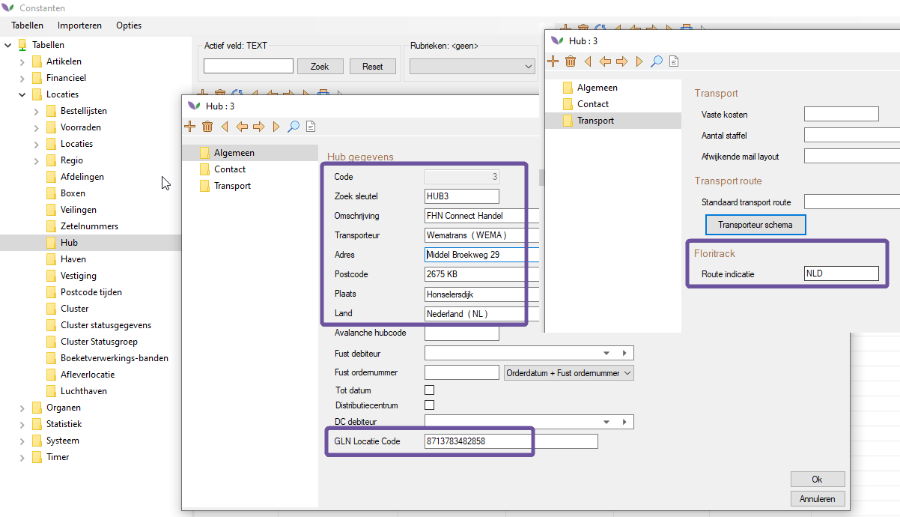

# Instructie Track & Trace module voor Florisoft gebruikers

## Inhoudsopgave

[Inleiding](#inleiding)

[Constanten instellingen](#constanten)

[Doos vullen / Karopbouw](#karopbouw)

[Track and Trace](#tracktrace)

[Transportbrief printen](#printen)

[Floritrack portal](#portal)

<a name="inleiding"/>

## Inleiding

Dit document beschrijft de werking van Track and Trace via Floritrack, en de instellingen die daarvoor nodig zijn.

Globaal is het proces als volgt:
* Kar wordt opgebouwd via doos vullen of karopbouw modules
* Bij 'print bon' of 'kar klaar' wordt bepaald of kar via Track & Trace gevolgd moet worden
    * _Bepaling vindt plaats o.b.v. Transporteur van de debiteur of hub_
* In het Track & Trace scherm verschijnt een regel per kar (bovenste grid).
    * _Het onderste grid toont alle deelleveringen op die kar - per debnr en ordnr_
* Kar wordt ingediend bij Floritrack 
    * _d.w.z. de API wordt aangesproken en stuurt informatie terug - shipment nr & document nr_
* O.b.v. deze info kan de begeleidende transportbrief geprint worden, met QR code
    * _1 brief per deellevering_
* Brieven gaan op de kar, transporteur scant de QR bij het ophalen
* Klant kan status van deelleveringen volgen via Floritrack portal 
    * _in de toekomst ook in Florisoft_

<a name="constanten"/>

## Constanten instellingen

### Transporteur instellingen

* Constanten > Organen > Transporteurs 

Op tab 'TrackTrace' > Selecteer Floritrack in de dropdown en vul de bedrijfsGLN in.
De GLN van de transporteur kan gevonden worden in de portal van Floritrack of via Floricode.
>Wematrans GLN code = 8713782645704

### Debiteur instellingen

Hier zijn een aantal velden van belang, voornamelijk het afleveradres en de GLN codes, omdat hierop gevalideerd wordt bij Floritrack.
Zonder juiste GLN codes lukt het indienen niet. 

Invullen:
* hoofdtab - veld GLN Code - vul hier de bedrijfscode in (GLNADRES)
* tab Afleveradres - veld GLN Code - vul hier de locatie GLN in (GLNLEVADR) 
    * _dit is meestal een box locatie op een veiling - wanneer een klant meerdere locaties heeft moeten er dus meerdere debiteuren aangemaakt worden, elk met een eigen locatie GLN (bv H. Star Rijnsburg & H. Star Naaldwijk)._
* Straat/Huisnr - Postcode - Plaats - Land 
* Transport adres (VBA voor veiling Aalsmeer, NLD voor Naaldwijk, RBG voor Rijnsburg)
* Hub (indien nodig, bv om verschillende klanten bij elkaar op de kar te kunnen zetten) - Transport > Locaties > Hub 

De GLN codes die gebruikt worden bij de debiteur kunnen ook gevonden worden in de Floritrack portal.

### Hub instellingen

__Indien bij de debiteur een hub ingesteld is, dan wordt de transporteur van die hub gebruikt i.p.v. die van de debiteur.__

Bij het indienen krijgt de gebruiker de keuze om de kar bij de Hub te laten bezorgen. 
> _Dit is nuttig als er op bepaalde tijdstippen gebruikt gemaakt wordt van een andere afleverlocatie, bv de logistieke afhandeling van de veiling zelf._

Hiervoor dient het adres en de locatie GLN van de Hub ingevuld te worden. 
> _Daarbij kan ook de 'Route indicatie' opgegeven worden. Deze wordt klaargezet als printvariabele._

## Doos vullen / Karopbouw
Als dit alles goed ingesteld is, en de gebruiker een kar heeft opgebouwd via doos vullen of karopbouw en op 'Print bon' of 'Kar klaar' klikt, wordt het Track & Trace scherm gevuld

<a name="tracktrace"/>

## Track and Trace scherm

Per gebruiker kan in de navigator de knop _Track and Trace_ toegevoegd worden.
> F12 om ontwerpmodus te openen, sleep de knop naar de juiste plek, F5 om op te slaan - per gebruiker instellen

Een druk op deze knop opent het volgende scherm.

__1.__ Menu: Hier kan de gebruiker functies starten die betrekking hebben op de rest van het scherm. O.a. filteren en detailscherm openen.

__2.__ Hoofdgrid: In dit overzicht zijn alle geregistreerde Track and Trace records (lees: karren) zichtbaar die vanuit karopbouw of doos vullen geregistreerd zijn. 
TRACKTRACE en FLORITRACK tabellen.

__3.__ Detailgrid: In dit overzicht zijn de regels te zien die ingediend worden als shipments (lees: deelleveringen per kar).
Hier kunnen meerdere regels van verschillende debiteuren/orders zichtbaar zijn. Dit is dus de totale inhoud van de kar.

__4.__ Rechtermuis menu: Via dit menu kan de gebruiker de zendingen indienen en/of printen. Een reeds ingediende zending kan niet nogmaals ingediend worden. Een printopdracht kan pas gestart worden nadat alle gegevens beschikbaar zijn na het indienen.
Er wordt altijd een transportbrief geprint per deellevering, want elke deellevering krijgt een unieke QR code.

__5.__ Statusbar: Hierin wordt weergegeven of een filter in het scherm actief is en hoeveel geselecteerde regels de gebruiker momenteel actief heeft. Door te dubbel klikken op de filter text, zal het filter scherm geopend worden.

Bij het indienen moet de ophaal- en aflevertijd gekozen worden. Deze staan standaard resp 1 en 2 uur in de toekomst maar kunnen aangepast worden.
Kies hier ook of de shipments bij de debiteur(en) afgeleverd moeten worden of bij de hublocatie. 

<a name="printen"/>

## Printen Transportbrief

Via rechtsklikken op een ingediende kar in het bovenste grid kan er geprint worden.

<a name="portal" />

## Floritrack portal

Via de url: https://app.floritrack.nl kan de portal benaderd worden. Hier kan de gebruiker inloggen met het verkregen account van Floritrack en zijn zendingen inzien. 
Voor de test omgeving moet de url: https://app.staging.floritrack.nl gebruikt worden. Bisit kan per klant een login regelen.
