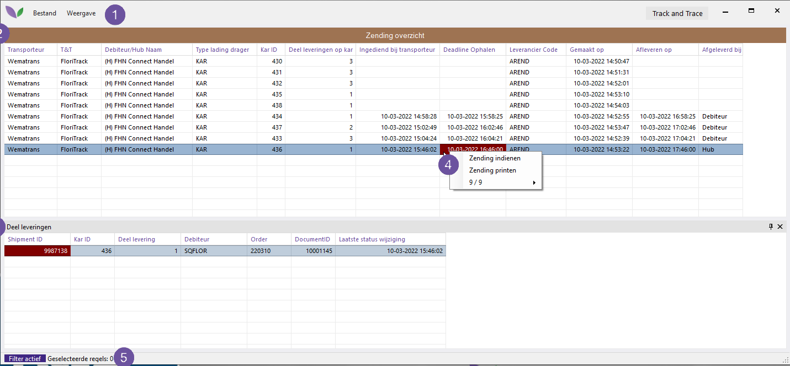
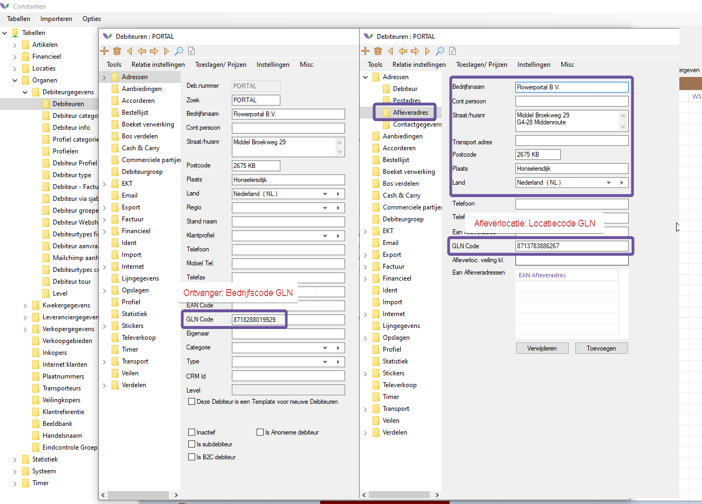

# Florisoft Manual Track and Trace (M178)

Dit document beschrijft de werking van Track and Trace via Floritrack en de instelling die daarvoor nodig zijn:

**Het globale proces is als volgt:**

* Kar wordt opgebouwd via doos vullen of karopbouw modules
* Bij 'print bon' of 'kar klaar' wordt bepaald of kar via Track & Trace gevolgd moet worden
    * _Bepaling vindt plaats o.b.v. Transporteur van de debiteur of hub_
* In het Track & Trace scherm verschijnt een regel per kar (bovenste grid).
    * _Het onderste grid toont alle deelleveringen op die kar - per debnr en ordnr_
* Kar wordt ingediend bij Floritrack 
    * _d.w.z. de API wordt aangesproken en stuurt informatie terug - shipment nr & document nr_
* O.b.v. deze info kan de begeleidende transportbrief geprint worden, met QR code
    * _1 brief per deellevering_
* Brieven gaan op de kar, transporteur scant de QR bij het ophalen
* Klant kan status van deelleveringen volgen via Floritrack portal 
    * _in de toekomst ook in Florisoft_

## Inhoudsopgave

[Constanten instellingen](#constanten-instellingen)  
[Transporteur instellingen](#transporteur-instellingen)  
[Doos vullen karopbouw](#doos-vullen--karopbouw)  
[Track and trace scherm](#track-and-trace-scherm)  
[Transportbrief printen](#printen-transportbrief)  
[Floritrack portal](#floritrack-portal)  

## Constanten instellingen

### Transporteur instellingen

|Stap|Uitleg|
|:-:|:--|
|**1**|Navigeer naar het volgende pad in de constanten: **Organen→Transporteurs**|
|**2**|Open vervolgens de destreffende het tab **TrackTrace**, vul de volgende gegevens in: - Zet de dropdown '**Maak gebruik van floritrack**' op '*Floritrack*' - Vul het veld '**GLNCode**' met de GLN code van de transporteur.   *In het onderstaande voorbeeld maken we gebruik van de GLN code van Wematrans = 8713782645704*

<b>Klik hier voor uw voorbeeld!</b>

|
|**2.a**|De GLN van de transporteur kan gevonden worden in de portal van Floritrack of via Floricode.|

### Debiteur instellingen

*Hier zijn een aantal velden van belang, voornamelijk het afleveradres en de GLN codes, omdat hierop gevalideerd wordt bij Floritrack. Zonder juiste GLN codes lukt het indienen niet.*

*Volg de onderstaande stappen:*

|Stap|Uitleg|
|:-:|:--|
|**1**|Navigeer naar het volgende pad in de constanten: **Organen→Debiteur gegevens→Debiteuren**|
|**2**|Vul het GLN code in met de: bedrijfscode oftewel het **GLNADRES**|
|**3**|Open de desbetreffende debiteur en navigeer naar het tabje: **Adressen→Afleveradres**  *Dit is meestal een box locatie op een veiling - wanneer een klant meerdere locaties heeft moeten er dus meerdere debiteuren aangemaakt worden, elk met een eigen locatie GLN (bv H. Star Rijnsburg & H. Star Naaldwijk).*|
|**4**|Vul in dit scherm ook de GLN code in, doe dit met **GLN locatie code.**|
|**5**|Vul daarnaast de volgende velden in indien deze nog leeg zijn: - **Bedrijfsnaam:** uw bedrijfsnaam - **Straat/huisnr**: vul hier adres in in - **Postcode** - **Plaats** - **Land** - **Transport adres**: VBA voor veiling Aalsmeer, NLD voor Naaldwijk, RBG voor Rijnsburg - **Hub**: (indien nodig, bv om verschillende klanten bij elkaar op de kar te kunnen zetten) - Transport > Locaties > Hub

<b>Klik hier voor uw voorbeeld!</b>

|
|**5.a**|De GLN codes die gebruikt worden bij de debiteur kunnen ook gevonden worden in de Floritrack portal.

<b>Klik hier voor uw voorbeeld!</b>

|

### Hub instellingen

#### Indien bij de debiteur een hub ingesteld is, dan wordt de transporteur van die hub gebruikt i.p.v. die van de debiteur.

Bij het indienen krijgt de gebruiker de keuze om de kar bij de Hub te laten bezorgen.  *Dit is nuttig als er op bepaalde tijdstippen gebruikt gemaakt wordt van een andere afleverlocatie, bv de logistieke afhandeling van de veiling zelf.*

*Hiervoor dient het adres en de locatie GLN van de Hub ingevuld te worden.*

|Stap|Uitleg|
|:-:|:--|
|**1**|Navigeer naar het volgende pad in de constanten: **Locaties→Hub** Open vervolgens de desbetreffende hub of maak een nieuwe aan.|
|**2**|Zorg ervoor dat de volgende gegevens zijn ingevuld: 1. **Code** 2. **Zoeksleutel** 3. **Omschrijving** 4. **Transporteur** 5. **Postcode** 6. **Plaats** 7. **Land** 8. **GLN code:** vul dit in met de GLN locatie code.

<b>Klik hier voor uw voorbeeld!</b>

|
|**3**|Daarbij kan ook de 'Route indicatie' opgegeven worden. Deze wordt klaargezet als printvariabele.  **Optioneel**: Navigeer naar het tab: **Transport**|
|**4**|**Optioneel**: Vul vervolgens het Route indicatie veld in.|

## Doos vullen / karopbouw

Als dit alles goed ingesteld is, en de gebruiker een kar heeft opgebouwd via doos vullen of karopbouw en op 'Print bon' of 'Kar klaar' klikt, wordt het Track & Trace scherm gevuld
<a name="tracktrace"/>

## Track and Trace Scherm

Per gebruiker kan in de navigator de knop Track and Trace toegevoegd worden. Hieronder een korte beschrijving over hoe u dit doet:

|Stap|Uitleg|
|:-:|:--|
|**1**|Ga naar de Florisoft Navigator en klik op de F12 knop om de ontwerpmodus te openen.

<b>Klik hier voor uw voorbeeld!</b>

|
|**2**|Sleep vervolgens de '*Track and Trace*' knop in de linkerkant van het scherm naar een plek in de Florisoft navigator.|
|**3**|Sla uw verandering op en verlaat de ontwerpmodus door op de F5 toets te klikken.|

In dit scherm kan u het volgende doen, volg de onderstaande stappen:

|Stap|Uitleg|
|:-:|:--|
|**1**|Open het track and trace scherm door op de zojuist geplaatste '*Track and Trace*' knop te drukkken.

<b>Klik hier voor uw voorbeeld!</b>

|
|**2**|Hieronder vind u een korte uitleg over dit scherm: **1. Menu:** Hier kan de gebruiker functies starten die betrekking hebben op de rest van het scherm. O.a. filteren en detailscherm openen.  **2. Hoofdgrid:** In dit overzicht zijn alle geregistreerde Track and Trace records (lees: karren) zichtbaar die vanuit karopbouw of doos vullen geregistreerd zijn. TRACKTRACE en FLORITRACK tabellen.  **3. Detailgrid:** In dit overzicht zijn de regels te zien die ingediend worden als shipments (lees: deelleveringen per kar). Hier kunnen meerdere regels van verschillende debiteuren/orders zichtbaar zijn. Dit is dus de totale inhoud van de kar.  **4. Rechtermuis menu:** Via dit menu kan de gebruiker de zendingen indienen en/of printen. Een reeds ingediende zending kan niet nogmaals ingediend worden. Een printopdracht kan pas gestart worden nadat alle gegevens beschikbaar zijn na het indienen. Er wordt altijd een transportbrief geprint per deellevering, want elke deellevering krijgt een unieke QR code.  **5. Statusbar:** Hierin wordt weergegeven of een filter in het scherm actief is en hoeveel geselecteerde regels de gebruiker momenteel actief heeft. Door te dubbel klikken op de filter text, zal het filter scherm geopend worden.

<b>Klik hier voor uw voorbeeld!</b>

|
|**3**|Bij het indienen moet de ophaal- en aflevertijd gekozen worden. Deze staan standaard resp 1 en 2 uur in de toekomst maar kunnen aangepast worden. Kies hier ook of de shipments bij de debiteur(en) afgeleverd moeten worden of bij de hublocatie.

<b>Klik hier voor uw voorbeeld!</b>

|

## Printen transportbrief

Via rechtsklikken op een ingediende kar in het bovenste grid kan er geprint worden.

<b>Klik hier voor uw voorbeeld!</b>

## Floritrack portal

Via de url: https://app.floritrack.nl kan de portal benaderd worden. Hier kan de gebruiker inloggen met het verkregen account van Floritrack en zijn zendingen inzien. 
Voor de test omgeving moet de url: https://app.staging.floritrack.nl gebruikt worden. Bisit kan per klant een login regelen.