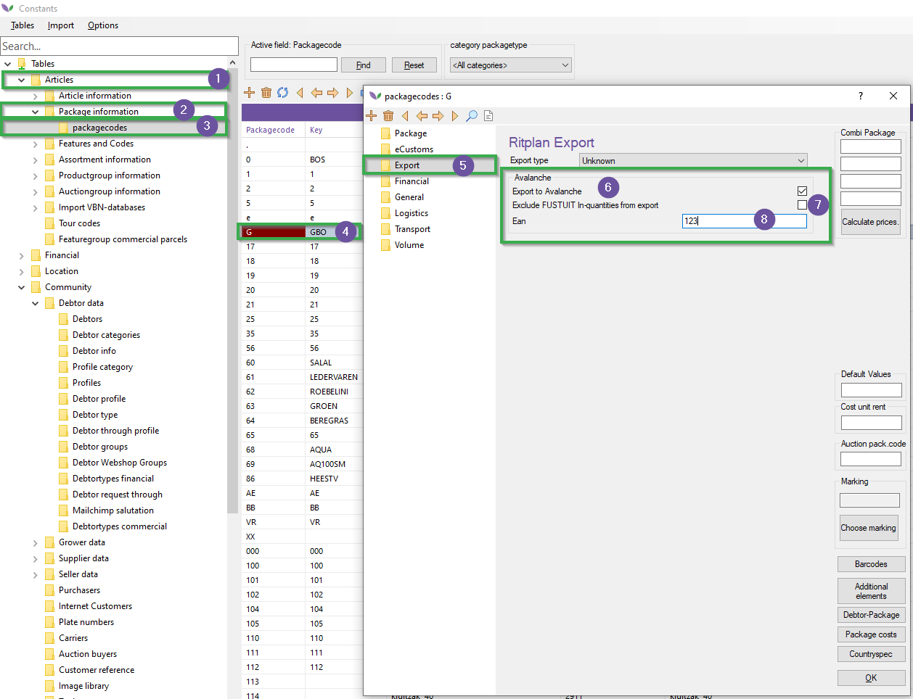

# Manual Track Online (M200)

This manual concerns the Florisoft module Track Online (formerly known as Avalanche). After reading this manual you will know how to set up the API connection and what packaging and debtors will be sent through the API.

## Setting Up the API Connection

|Step|Explanation|
|:-:|:--|
|**1**|From the Florisoft navigator, click on the **deliver** button (on top of the screen). This opens a context menu in which you will need to click on the option **Export package to Avalanche**.

<b>Click here for the example image!</b>

|
|**2**|This will open a new window, in this window configure the following fields :  - In the dropdown menu (#1) select **TrackOnlineAPI** After selecting this two new text input fields will appear at the bottom of the window.  - **Track Online API Key** : *the api key for the Track Online API* **Track Online API URL** : *URL for the Track Online URL.*

<b>Click here for the example image!</b>

|
|**3**|Enable the checkbox **Export packages** (#5)|
|**4**|After filling out these fields pressing the **Export** button will cause the found package items to be exported.

<b>Click here for the example image!</b>

|

## Setting up relevant packages

|Step|Explanation|
|:-:|:--|
|**1**|Open the constants screen and navigate to following path : **Articles→Package Information→packagecodes**

<b>Click here for the example image!</b>

|
|**2**|Open a package type that you will want to export to Track Online (Avalanche) and go to the **Export** tab. 

<b>Click here for the example image!</b>

|
|**3**|In this tab you will need to fill out the settings under the heading **Avalanche** :  - **Export to Avalanche** : this will need to be enabled for this package type to be exported to Avalanche. **Exclude FUSTUIT in-quantities from Export** : by enabling this checkbox you will only send the outgoing packaging and **not** the incoming. - **EAN** : here you set the corresponding EAN code for packaging you will want to track. 

<b>Click here for the example image!</b>

|
|**4**|Save the made changes and close the packagecode card. |
|**5**|Repeat steps 2-4 for every package type that needs to be exported.|

## Configuring the debtors

|Step|Explanation|
|:-:|:--|
|**1**|In the constants screen navigate you will need to navigate to the following path : **Community→Debtor Data→Debtors**

<b>Click here for the example image!</b>

|
|**2**|Open a debtor you want to export.|
|**3**|In the debtor card navigate to the folder **Export**

<b>Click here for the example image!</b>

|
|**4**|In this tab we will want to configure the input fields under the heading **Avalanche Export 1** :  **Logistic number** : enter the Track online logistic number (Mandatory). **Category** : Track online category ID (Optional) **Data Exported** : Check the checkbox to enabling the debtor to be send to Track Online (Mandatory).

<b>Click here for the example image!</b>

|
|**5**|Now for the fields under the heading **Avalanche Export 2**:   **location number** : here you can enter a deviating location number, these should be pre-configured in Track Online (default = 1) (Optional) **Do not export package to avalanche** : disables the export of packages to Track online for said location number.

<b>Click here for the example image!</b>

|

## System setup (Optional)

Aside from the previous steps configuring the API login and constants data we can also configure which date gets sent to Track Online. We can configure this using the system setting **TrackOnlineDateTransactionNow**, by setting this to True Florisoft will send the current date instead of the InvoiceHeaders invoice date.

|Step|Explanation|
|:-:|:--|
|**1**|In the florisoft navigator go to **Maintenance** → **Setup System**|
|**2**|In the newly opened Window go to the tab **Advanced**|
|**3**|Enter the authorization code.|
|**4**|Search the settings (F3) for the following setting : **TrackOnlineDateTransactionNow**.|
|**5**|Set this to **True** if you want to use the current date instead of the invoice's date|

## Timer process 

In the first chapter of this manual we learned how to manually export packaging to Track Online (by clicking on the export button) however, we can automate this process by utilizing the Timer. To do this you need to enable the timerprocess **Avalanche Export 2 ( same as UI export ->Avalanche)** (EXPORTAVALANCHE2) on the Timer client. 