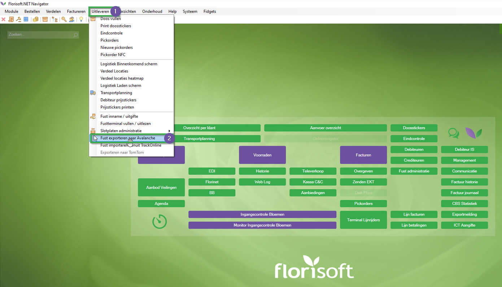

# Handleiding Track Online (M200)

Deze handleiding betreft de Florisoft-module Track Online (voorheen bekend als Avalanche). Na het lezen van deze handleiding weet u hoe u de API-verbinding instelt en welke verpakkingen en debiteuren via de API worden verzonden.

## API-verbinding instellen

|Stap|Uitleg|
|:-:|:--|
|**1**|Klik in de Florisoft-navigator op de knop **uitleveren** (bovenaan het scherm). Dit opent een contextmenu waarin u de optie **Fust exporteren naar Avalanche** moet selecteren.

<b>Klik hier voor de voorbeeldafbeelding!</b>

|
|**2**|Er opent een nieuw venster waarin u de volgende velden configureert:  - Selecteer in het dropdownmenu (#1) **TrackOnlineAPI**. Nadat u dit heeft geselecteerd, verschijnen er twee nieuwe tekstvelden onderaan het venster.  - **Track Online API Key**: *de API-sleutel voor de Track Online API* **Track Online API URL**: *de URL voor Track Online.*

<b>Klik hier voor de voorbeeldafbeelding!</b>

|
|**3**|Zet een vinkje bij de checkbox **Fusten exporteren**|
|**4**|Nadat u deze velden hebt ingevuld, zal het klikken op de knop **Exporteren** ervoor zorgen dat de gevonden pakketitems worden geëxporteerd.

<b>Klik hier voor de voorbeeldafbeelding!</b>

|

## Relevante Fusten instellen

|Stap|Uitleg|
|:-:|:--|
|**1**|Open het scherm met constanten en navigeer naar het volgende pad: **Artikelen → Verpakkingsinformatie → Verpakkingcodes**.

<b>Klik hier voor de voorbeeldafbeelding!</b>

|
|**2**|Open een verpakkingstype dat u wilt exporteren naar Track Online (Avalanche) en ga naar het tabblad **Export**.

<b>Klik hier voor de voorbeeldafbeelding!</b>

|
|**3**|In dit tabblad vult u de instellingen in onder de kop **Avalanche**:  - **Exporteren naar Avalanche**: Dit moet worden ingeschakeld voor dit verpakkingstype. **FUSTUIT-hoeveelheden uitsluiten van Export**: Door dit vakje aan te vinken, stuurt u alleen de uitgaande verpakkingen en **niet** de inkomende. - **EAN**: Hier stelt u de corresponderende EAN-code in voor de verpakking die u wilt volgen.

<b>Klik hier voor de voorbeeldafbeelding!</b>

|
|**4**|Sla de gemaakte wijzigingen op en sluit de verpakkingcodekaart.|
|**5**|Herhaal stappen 2-4 voor elk verpakkingstype dat moet worden geëxporteerd.|

## Debiteuren configureren

|Stap|Uitleg|
|:-:|:--|
|**1**|In het scherm met constanten navigeert u naar het volgende pad: **Community → Debiteurengegevens → Debiteuren**.

<b>Klik hier voor de voorbeeldafbeelding!</b>

|
|**2**|Open een debiteur die u wilt exporteren.|
|**3**|Ga in de debiteurkaart naar de map **Export**.

<b>Klik hier voor de voorbeeldafbeelding!</b>

|
|**4**|In dit tabblad configureren we de invoervelden onder de kop **Avalanche Export 1**:  **Logistiek nummer**: Vul het logistieke nummer van Track Online in (Verplicht). **Categorie**: ID van de Track Online-categorie (Optioneel). **Gegevens geëxporteerd**: Vink dit vakje aan om de debiteur te exporteren naar Track Online (Verplicht).

<b>Klik hier voor de voorbeeldafbeelding!</b>

|
|**5**|Voor de velden onder de kop **Avalanche Export 2**:  **Locatienummer**: Hier kunt u een afwijkend locatienummer invoeren, deze moeten vooraf in Track Online worden geconfigureerd (standaard = 1) (Optioneel). **Geen verpakkingen exporteren naar Avalanche**: Schakelt de export van verpakkingen naar Track Online uit voor dit locatienummer.

<b>Klik hier voor de voorbeeldafbeelding!</b>

|

## Systeeminstellingen (Optioneel)

Naast de vorige stappen om de API-login en constanten te configureren, kunnen we ook instellen welke datum naar Track Online wordt gestuurd. Dit kunnen we configureren met de systeeminstelling **TrackOnlineDateTransactionNow**. Door deze op True te zetten, stuurt Florisoft de huidige datum in plaats van de factuurdatum van InvoiceHeaders.

|Stap|Uitleg|
|:-:|:--|
|**1**|Ga in de Florisoft-navigator naar **Onderhoud** → **Systeem setup**.|
|**2**|Ga in het nieuw geopende venster naar het tabblad **Geavanceerd**.|
|**3**|Voer de autorisatiecode in.|
|**4**|Zoek de instelling (F3): **TrackOnlineDateTransactionNow**.|
|**5**|Zet deze op **True** als u de huidige datum wilt gebruiken in plaats van de factuurdatum.|

## Timerproces 

In het eerste hoofdstuk van deze handleiding hebben we geleerd hoe u verpakkingen handmatig kunt exporteren naar Track Online (door op de exportknop te klikken). We kunnen dit proces echter automatiseren met behulp van de Timer. Hiervoor moet u het timerproces **Avalanche Export 2 (zelfde als UI export -> Avalanche)** (EXPORTAVALANCHE2) inschakelen op de Timer-client.
