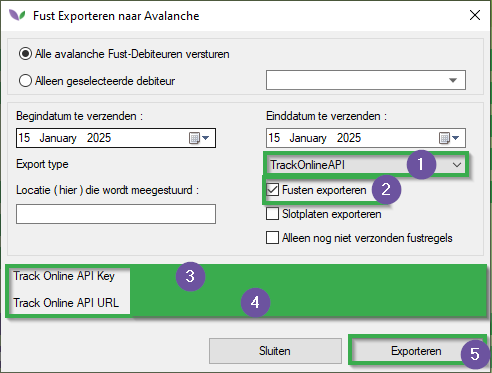

# Handleiding Track Online (M200)

Deze handleiding betreft de Florisoft-module Track Online (voorheen bekend als Avalanche). Na het lezen van deze handleiding weet u hoe u de API-verbinding instelt en welke fusten en debiteuren via de API worden verzonden.

## API-verbinding instellen

|Stap|Uitleg|
|:-:|:--|
|**1**|Klik in de Florisoft-navigator op de knop **uitleveren** (bovenaan het scherm). Dit opent een contextmenu waarin u de optie **Fust exporteren naar Avalanche** moet selecteren.

<b>Klik hier voor de voorbeeldafbeelding!</b>

|
|**2**|Er opent een nieuw venster waarin u de volgende velden configureert:  - Selecteer in het dropdownmenu (#1) **TrackOnlineAPI**. Nadat u dit heeft geselecteerd, verschijnen er twee nieuwe tekstvelden onderaan het venster.  - **Track Online API Key**: *de API-sleutel voor de Track Online API* **Track Online API URL**: *de URL voor Track Online.*

<b>Klik hier voor de voorbeeldafbeelding!</b>

|
|**3**|Zet een vinkje bij de checkbox **Fusten exporteren**|
|**4**|Nadat u deze velden hebt ingevuld, zal het klikken op de knop **Exporteren** ervoor zorgen dat de gevonden pakketitems worden geëxporteerd.

<b>Klik hier voor de voorbeeldafbeelding!</b>

|

## Relevante Fusten instellen

|Stap|Uitleg|
|:-:|:--|
|**1**|Open het scherm met constanten en navigeer naar het volgende pad: **Artikelen → Fust informatie → Fust soorten**.

<b>Klik hier voor de voorbeeldafbeelding!</b>

|
|**2**|Open een fustsoort dat u wilt exporteren naar Track Online (Avalanche) en ga naar het tabblad **Export**.

<b>Klik hier voor de voorbeeldafbeelding!</b>

|
|**3**|In dit tabblad vult u de instellingen in onder de kop **Avalanche**:  - **Exporteren naar Avalanche**: Dit moet worden ingeschakeld voor deze fustsoort. **FUSTUIT-hoeveelheden uitsluiten van Export**: Door dit vakje aan te vinken, stuurt u alleen de uitgaande fusten en **niet** de inkomende. - **EAN**: Hier stelt u de corresponderende EAN-code in voor de fust die u wilt volgen.

<b>Klik hier voor de voorbeeldafbeelding!</b>

|
|**4**|Sla de gemaakte wijzigingen op en sluit de fustsoortkaart.|
|**5**|Herhaal stappen 2-4 voor elk fustsoort dat moet worden geëxporteerd. Zorg dat je de geconfigureerde fusten ergens op schrijft zodat je deze later aan kan maken in je Trackonline omgeving.|

## Fusten (items) aanmaken in de Track Online omgeving

Nu dat je de fusten heb geconfigureerd in uw backoffice moeten ze nog aangemaakt worden in de Track Online omgeving. Als dit niet gedaan is zullen API request met deze fusten niet ingelezen worden.

|Stap|Uitleg|
|:-:|:--|
|**1**|Log [hier](https://trackonline.b2clogin.com/trackonline.onmicrosoft.com/b2c_1_signinto/oauth2/v2.0/authorize?client_id=568f4f53-b19c-4b77-8dbd-9fbf4dc94e71&scope=https%3A%2F%2FTrackOnline.onmicrosoft.com%2F48ca3e86-7a55-4381-a079-0471bf9fc98a%2Fapi.access%20openid%20profile%20offline_access&redirect_uri=https%3A%2F%2Fapp.trackonline.com%2Fauthenticating&client-request-id=a68f7b13-5536-4548-964b-8fb5407a8cd8&response_mode=fragment&response_type=code&x-client-SKU=msal.js.browser&x-client-VER=3.6.0&client_info=1&code_challenge=d84oOTpnFjIKtmXm3UPIS5ueblj_CZNAZ6PW2kN6HTU&code_challenge_method=S256&nonce=e0893369-288b-4d72-b744-94daa93791fd&state=eyJpZCI6IjVmMGY0ZmE3LTA0YWEtNDUwOS05MmZjLTRlNDAxZGZjZjg0MyIsIm1ldGEiOnsiaW50ZXJhY3Rpb25UeXBlIjoicmVkaXJlY3QifX0%3D) in op uw Track Online omgeving|
|**2**|Open de *items* pagina (#1).

<b>Klik hier voor uw voorbeeld!</b>

|
|**3**|Klik op de toevoegen knop (+).

<b>Klik hier voor uw voorbeeld!</b>

|
|**4**|Vul de volgende velden in met de fustcode (uit uw backoffice): **Naam** **Nummer** **Naam verkort**

<b>Klik hier voor uw voorbeeld!</b>

|
|**5**|Klik op de **opslaan** knop.

<b>Klik hier voor uw voorbeeld!</b>

|
|**6**|We kunnen nu de externe nummers aanpassen, ga naar het tabje **externe nummers**.

<b>Klik hier voor uw voorbeeld!</b>

|
|**7**|As externe bron selecteert u **Florisoft** in de dropdown.

<b>Klik hier voor uw voorbeeld!</b>

|
|**8**|Klik op de **opslaan** knop.

<b>Klik hier voor uw voorbeeld!</b>

|
|**9**|Herhaal dit voor de nodige fusten (items).|

## Debiteuren configureren

|Stap|Uitleg|
|:-:|:--|
|**1**|In het scherm met constanten navigeert u naar het volgende pad: **Community → Debiteurengegevens → Debiteuren**.

<b>Klik hier voor de voorbeeldafbeelding!</b>

|
|**2**|Open een debiteur die u wilt exporteren.|
|**3**|Ga in de debiteurkaart naar de map **Export**.

<b>Klik hier voor de voorbeeldafbeelding!</b>

|
|**4**|In dit tabblad configureren we de invoervelden onder de kop **Avalanche Export 1**:  **Logistiek nummer**: Vul het logistieke nummer van Track Online in (Verplicht). **Categorie**: ID van de Track Online-categorie (Optioneel). **Gegevens geëxporteerd**: Vink dit vakje aan om de debiteur te exporteren naar Track Online (Verplicht).

<b>Klik hier voor de voorbeeldafbeelding!</b>

|
|**5**|Voor de velden onder de kop **Avalanche Export 2**:  **Locatie nummer**: Hier kunt u een afwijkend locatienummer invoeren, deze moeten vooraf in Track Online worden geconfigureerd (standaard = 1) (Optioneel). **Fust niet exporteren naar Avalanche**: Schakelt de export van fusten naar Track Online uit voor dit locatienummer.

<b>Klik hier voor de voorbeeldafbeelding!</b>

|

## Systeeminstellingen (Optioneel)

Naast de vorige stappen om de API-login en constanten te configureren, kunnen we ook instellen welke datum naar Track Online wordt gestuurd. Dit kunnen we configureren met de systeeminstelling **TrackOnlineDateTransactionNow**. Door deze op True te zetten, stuurt Florisoft de huidige datum in plaats van de factuurdatum van InvoiceHeaders.

|Stap|Uitleg|
|:-:|:--|
|**1**|Ga in de Florisoft-navigator naar **Onderhoud** → **Systeem setup**.|
|**2**|Ga in het nieuw geopende venster naar het tabblad **Geavanceerd**.|
|**3**|Voer de autorisatiecode in.|
|**4**|Zoek de instelling (F3): **TrackOnlineDateTransactionNow**.|
|**5**|Zet deze op **True** als u de huidige datum wilt gebruiken in plaats van de factuurdatum.|

## Timerproces 

In het eerste hoofdstuk van deze handleiding hebben we geleerd hoe u fusten handmatig kunt exporteren naar Track Online (door op de exportknop te klikken). We kunnen dit proces echter automatiseren met behulp van de Timer. Hiervoor moet u het timerproces **Avalanche Export 2 (zelfde als UI export -> Avalanche)** (EXPORTAVALANCHE2) inschakelen op de Timer-client.
