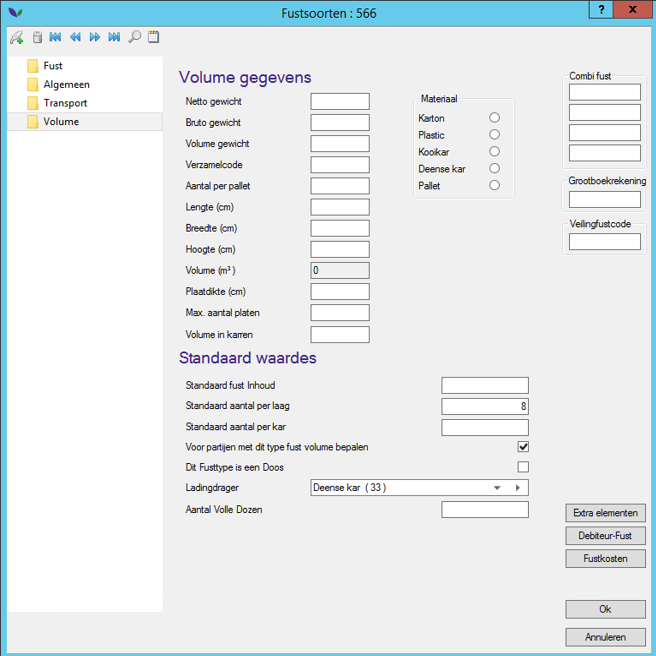
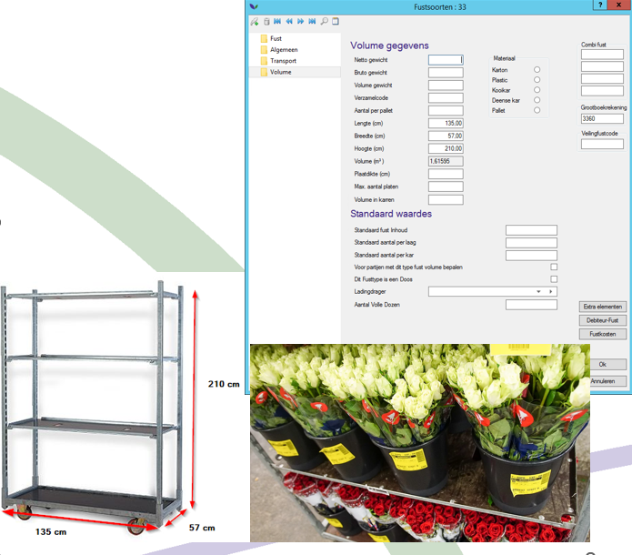
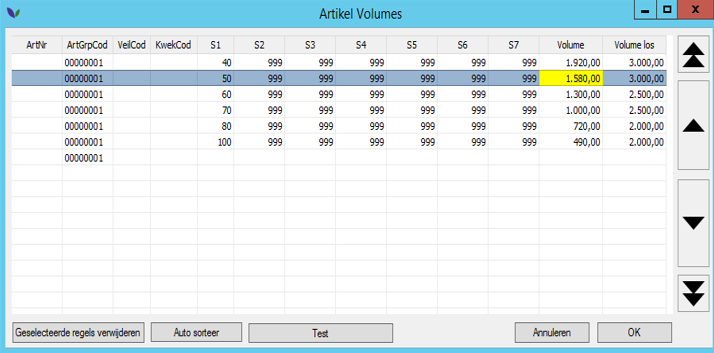
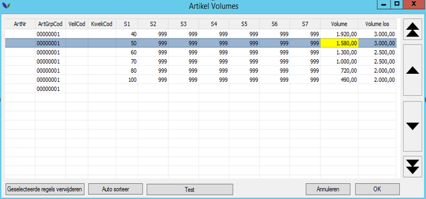
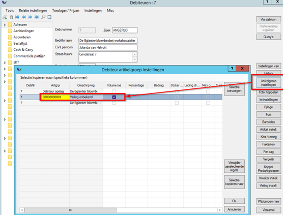
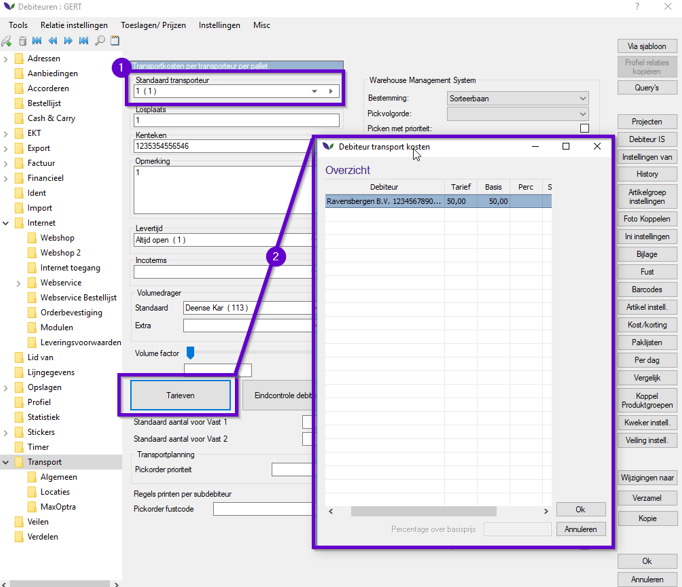
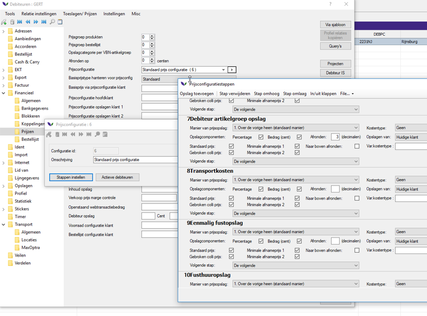
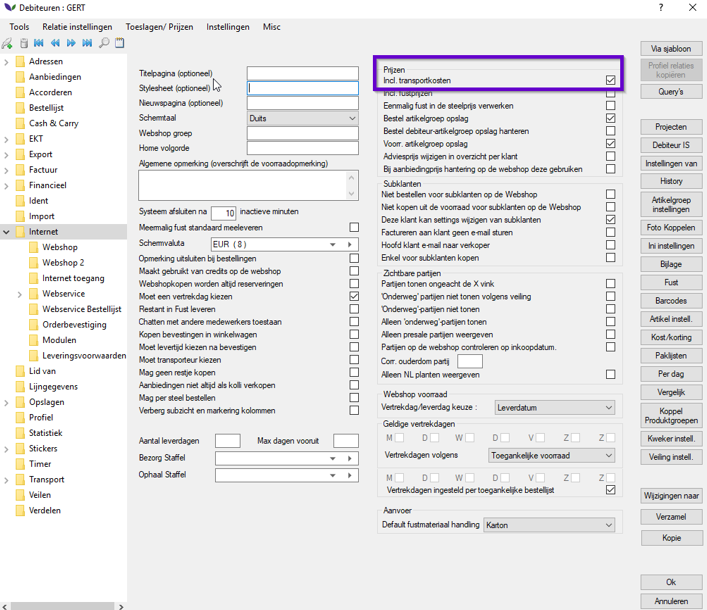
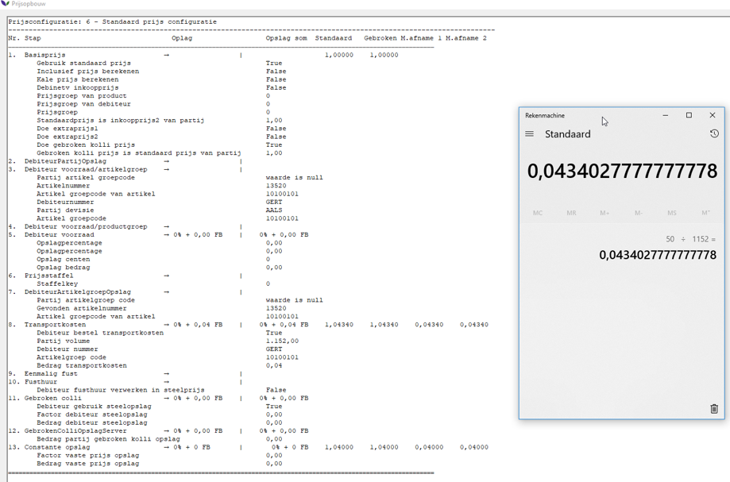
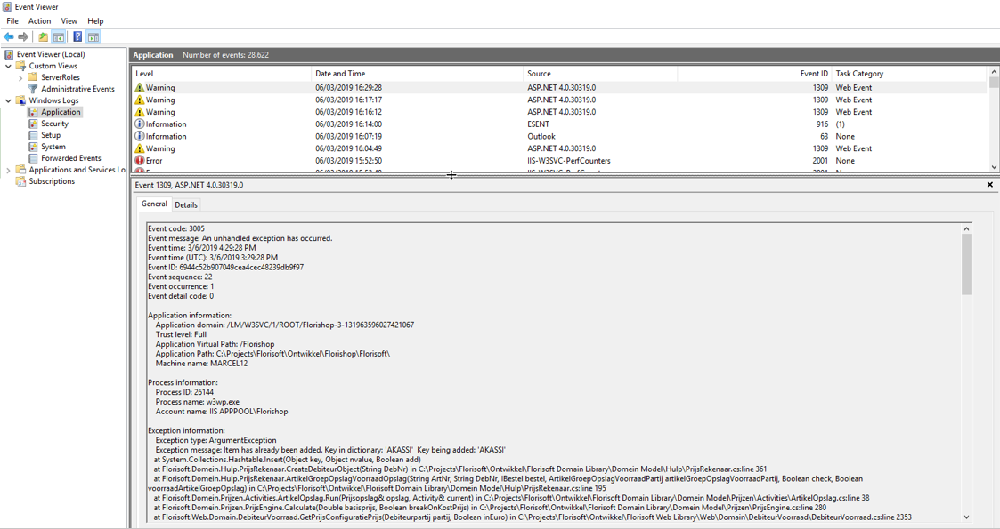

# Handleiding Volume calculatie

## Inhoudsopgave

Het doel van de Volume calculatie is:
- **Transport karren berekenen**: Dit is voor indicatie in bijvoorbeeld de Webshop. Of eigen overzicht om door te geven aan de transporteur hoeveel karren er ongeveer moeten worden opgehaald.
- **Transport kosten berekenen**: Iedere transporteur heeft een eigen per per kar.

<u>De twee veelgebruikte manieren voor volume zijn:</u> 
- **Ladingkardrager**
    Bij fustcodes kunnen we aangeven dat vhet volume berekend word aan de hand van een aantal fusten per laag, en de hoogte van het product

Klik hier voor de voorbeeld afbeelding

 

Hieronder volgt een voorbeeld met rekenen:

|Stap|Uitleg|
|:-:|:--|
|**1**|Een Deense kar is bij de klant <u> 210cm hoog </u>. (afhankelijk hoe hoog je auto is en dus boven de palen kan opbouwen.|
|**2**|In het voorbeeld zie je dat er 4 fusten op 1 rij passen. In de breedte passen er 2 fusten. Totaal <u> 8 fusten per laag bij dit type kar</u>|
|**3**|Dit product is <u>50 cm hoog</u>. Tussen de opbouwlagen wordt <u>5 cm vrije ruimte gerekend </u>. Dus eigenlijk zit er totaal <u>55cm per laag gerekend</u>|
|**4**|210cm / 55cm = 3.8 lagen. Dus per Deense kar passen er 3 lagen om te vervoeren.|
|**5**|3 lagen * 8 blikken = 24. 24 * inhoud van de partij (**100**) = 2400 per kar.|
|**6**|2400 per kar / 1,62 (m3 per kar) = 1481 stelen per m3, wat dan gevuld wordt in de voorraad in de kolum volume.|

Klik hier voor de voorbeeld afbeelding

 

-----
**Artikel volume**
|Stap|Uitleg|
|:-:|:--|
|**1**|Voor het berekenen van het volume van de artikelen (Artikelvolume) , wordt er niet gerekend met de inhoud van de partij maar geef je zelf aan hoeveel stelen er passen per m3 van die partij met bijbehorende sorteringskenmerken ( waarvan lengte voor bloemen een hele belangrijke is ).|
|**2**|Bij de artikelgroep en/of artikel kun je instellen hoeveel stelen er per m3 passen als je het met fust opbouwt of zonder fust ( volume en volume los ). Dit werkt met een t/m waarde.|

Klik hier voor de voorbeeld afbeelding

 

Hieronder volgt een voorbeeld berekening:
|Stap|Uitleg|
|:-:|:--|
|**1**|Ook hierbij is het verstandig om uitrekenen hoeveel fusten ze in totaal kunnen opbouwen van deze artikelen op een volle ladingdrager.|
|**2**|Voorbeeld: Lengte van de partij is 50 cm, dus de 2de regel uit bovenstaand voorbeeld van het artikel zou de berekening worden.|
|**3**|Er passen bijvoorbeeld 4 lagen van lengte 50 op 1 kar. En per laag 8 blikken. 32 blikken totaal x 80 inhoud ( wat deze partij vaak is ) = 2560 stelen per volle ladingdrager. 1,62 m3 was het volume van de ladingdrager in eerder genoemd voorbeeld dus: 2560 / 1,62 = 1580 stelen per m3. Zou je het zonder fust opbouwen, zou dit zelfs 3000 stelen per m3 zijn.|

Klik hier voor de voorbeeld afbeelding

 

---

**Volume los**  
Per debiteur kun je per artikelgroep aangeven of je deze artikelgroep los laadt ( voor berekeningen van bijvoorbeeld op de Webshop waar de klant niet kan kiezen of hij het zonder fust of met fust koopt. 

Klik hier voor de voorbeeld afbeelding

 

---

**Transportkosten**
Prijsconfiguratie stap: 
Kijkt wat de klant voor partijen ziet en wat het volume is. Bij de debiteur staat een standaard transporteur ingesteld. Bij transporteur staat hoeveel deze kost. (per kuub basis) dan gaat de steelprijs omhoog met de transport kosten.

De volgtende afbeeldingen helpen bij het instellen van de transportkosten:

Klik hier voor de voorbeeld afbeelding

 

Klik hier voor de voorbeeld afbeelding

 

Klik hier voor de voorbeeld afbeelding

 

---

De volgende afbeelding schetst een voorbeeld van de transportkosten:

Klik hier voor de voorbeeld afbeelding

 

---

De volgende afbeelding schetst de Eventviewer:

Klik hier voor de voorbeeld afbeelding

 
s
---

En de bijbehorende systeem instellingen:
- PartijVolumeViaKarAant **true**
- VolumeBerekeningVolgorde: LadingKardrager, Artikelvolume

