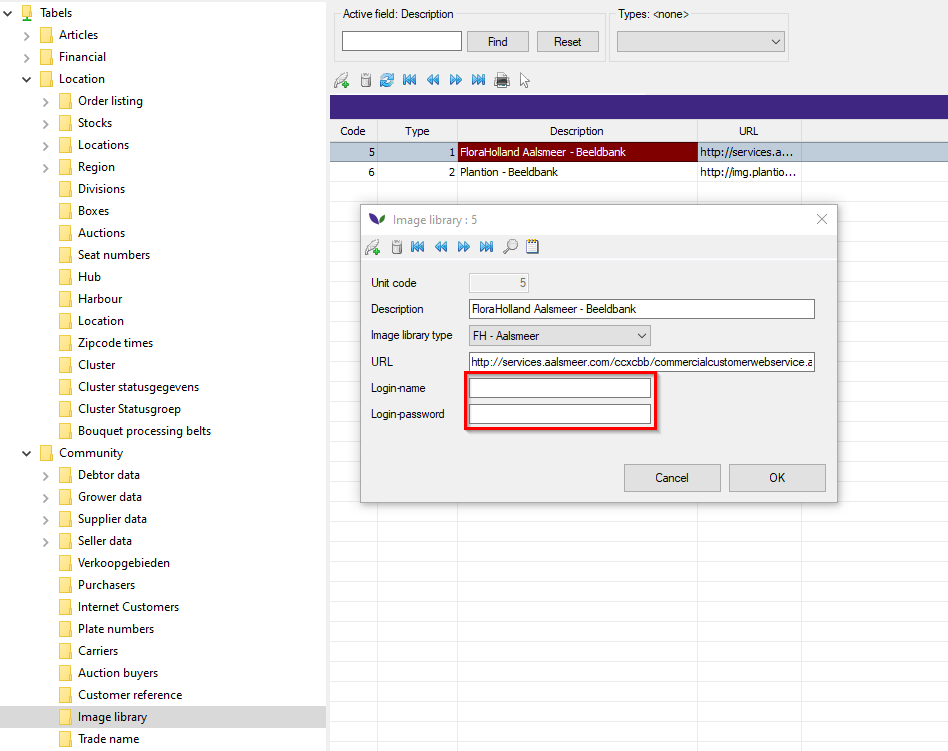
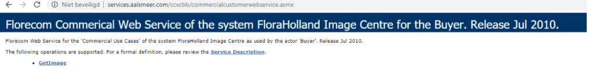
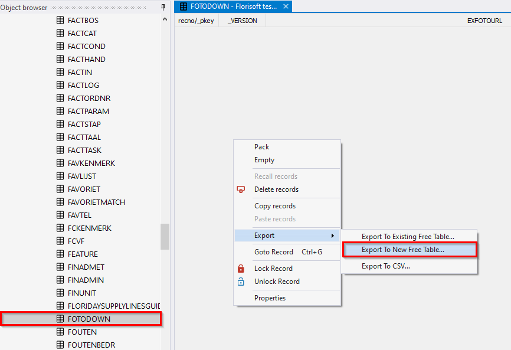

# Florisoft manual Image library

Welcome to the Florisoft Imagebank manual for desktop. This guide is
designed to teach the users how to use the Image library module. After
reading the guide, the user is able to successfully use the Photolibrary
module.

When you buy on the KLOK, you will get a number (PHOTOID).
With the Image library you will be able to download specific photo's using the
PHOTOID. When downloading photo's, Florisoft will scale them to 4 formats.

## Setting up
In order to start using the Image library module, a few settings have to be adjusted.

Start by starting up the Florisoft application and accessing the Constants -> Community -> Image library.

Double click an image library and enter the Flora Holland username and password. 
This information must be provided by the customer.

To make sure the information that has been provided is correct, you can go to
the URL given. An example of such a URL is:
http://services.aalsmeer.com/ccvcbb/commercialcustomerwebservice.asmx

After logging in, the following screen should pop up:

Now head back to Florisoft and access the timer settings by right clicking the
 timer and selecting Timer Settings.

In the Timer Settings, find the setting "Foto Download X fotos" or it's English
 variant "Image Download X Images".
Check the box to the left of the settings.

Now navigate to the right screen of the timer settings, click the tab which says
 "Instellingen" or it's English
variant "settings". There are a few settings which will have to be double checked.

First, make sure the following setting is set to true:

Second, make sure the images have a destination. Choose a path, this is where
 your images will end up.

Once these settings have been corrected, open the Florisoft Data Architect and
 find the FOTODOWN table.

#### !! You are now entering the Florisoft database, this means all information stored in Florisoft is found here. Tampering with information can seriously limit the functionality of Florisoft, so please <u>only</u> change what is described here !!

Once in the FOTODOWN table, you will have to make a backup. You can do this by 
clicking your right mouse button and navigating to Export -> Export to new Free table.
You will now have to select a place to backup the table, we used C:\Shared\Florisoft\BuTabellen.

Make sure this backup has been done right, since now you will be deleting all records.
You can do that by right clicking in the table and selecting 3/17 (bottom option) -> select inverse.
Now choose delete (bottom left).

Once this is done, head back over to the Florisoft Navigator and access the Constants. 

Select Locations -> Auctions and select an auction. Double click and select Other.
Now make sure the two highlighted setting have been set correctly.

Now turn on the timer. Click the stopwatch icon to open up the Timer.

A list of active timers will show, click "Annuleren" or its English variant "Cancel"
and restart the timer by clicking the stopwatch icon again.

