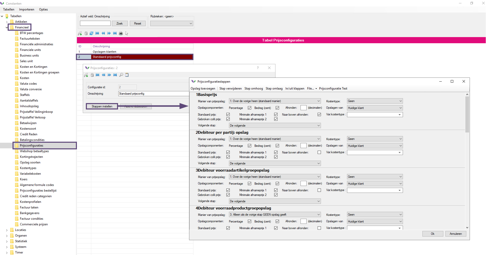
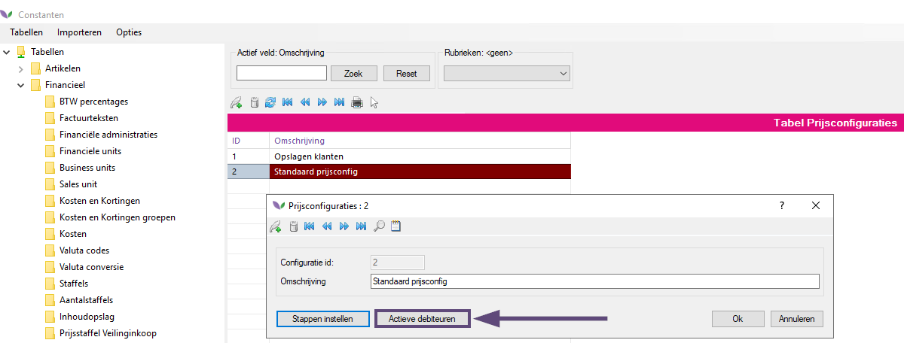
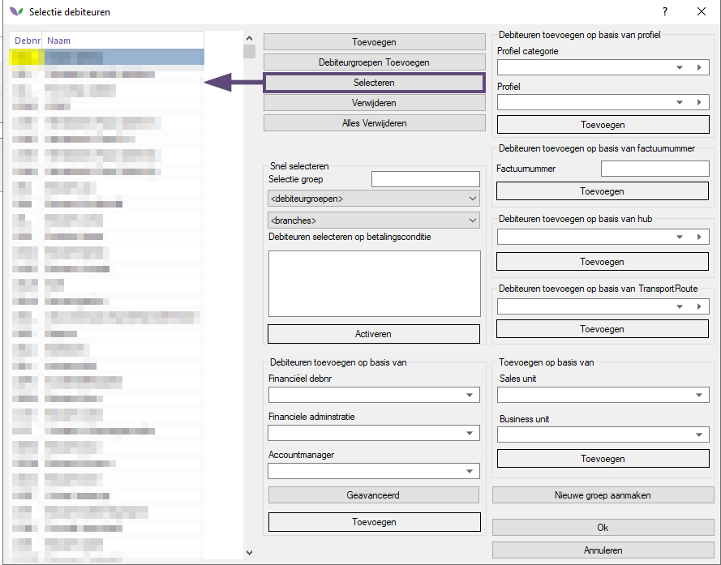
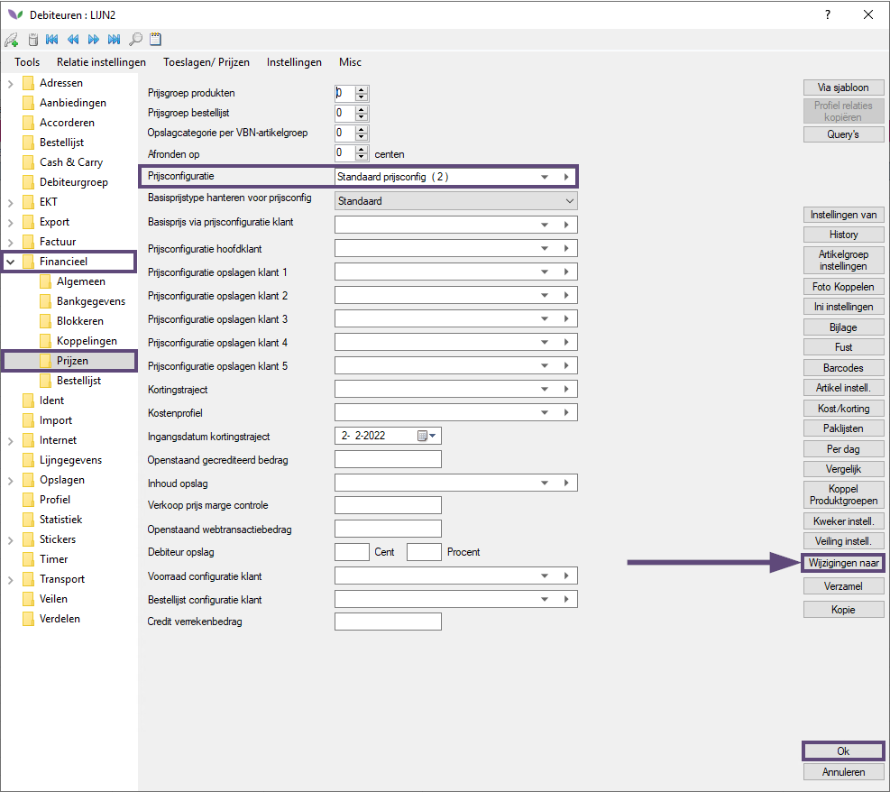
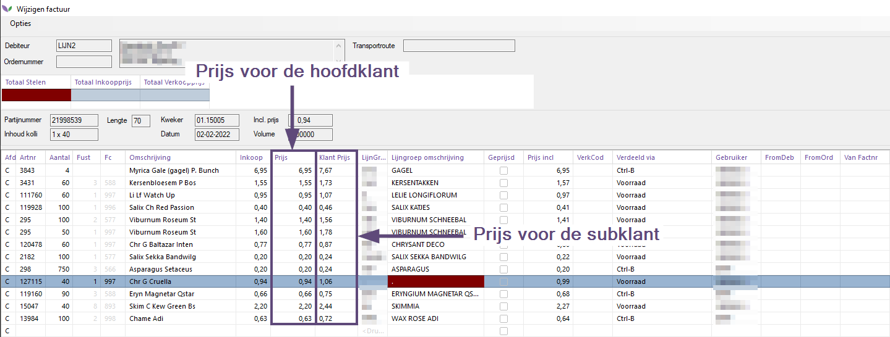

# Documentatie EKT eindprijzen client

Beschrijving van de module EKT eindprijzen (server kant) in Florisoft.

## 1. Inleiding
In deze handleiding wordt de (technische) werking van de module EKT eindprijzen (server kant) beschreven. De focus ligt in dit document voornamelijk op de logica van deze module.

Veel webshops worden door hoofdklanten gebruikt die daarachter hun eigen automatisering hanteren. Zowel de systemen van de hoofd- als de subklant moeten worden voorzien van correcte informatie, met name eindprijsinformatie voor de subklant. De module EKT eindprijzen server maakt dit mogelijk.

Het voordeel hierbij is dat de hoofdklant gebruik maakt van het systeem van de klant en dus ook het assortiment in dit systeem.

De module EKT eindprijzen server maakt factureren voor de hoofdklant naar de subklant eenvoudiger. Het is niet langer nodig om handmatig prijzen in te geven voor de subklant. De prijzen voor de subklanten worden direct meegestuurd in de EKT.

Met de module EKT eindprijzen server bevat de verstuurde EKT twee prijzen: één voor de hoofdklant en één voor de subklant. Hiervoor wordt het volgende segment gebruikt: PRI+INV:0.27:::0.36.

In bovenstaand voorbeeld is 0.27 ct. de prijs voor de hoofdklant. De 0.36 ct. is de prijs voor de subklant. Voorwaarde voor het correct laten functioneren van de module EKT eindprijzen server is dat het systeem van de hoofdklant deze extra informatie moet kunnen inlezen en verwerken.

## 2. Module  activeren
De eerste stap bestaat uit het activeren van de module EKT Eindprijzen server:

.png)

Deze module kan middels een licentiecode toegevoegd worden aan het licentiebestand van de klant. De licentiecode komt beschikbaar na akkoord op de bijbehorende offerte.

> **Let op: na het activeren van de module dient Florisoft herstart te worden.**

## 3. Prijsconfiguratie(s) inrichten
Prijzen worden in Florisoft altijd berekend middels een prijsconfiguratie. Een prijsconfiguratie is een verzameling instellingen (stappen in oplopende volgorde) die een prijs opbouwt voor een klant(groep)

Prijsconfiguraties zijn terug te vinden in de Constanten onder het tabblad Financieel -> Prijsconfiguraties. Zie onderstaand screenshot voor een voorbeeld:

Correcte prijzen voor eindklanten kunnen grofweg op twee manieren berekend worden: door eenzelfde prijsconfiguratie te gebruiken voor zowel de hoofd als de subklant of kiezen voor een aparte prijsconfiguratie voor de hoofd en subklant.

Per klant moet in kaart gebracht worden wat hierin de beste werkzijze is. Daarnaast moeten de prijzen voor de hoofd en subklanten correct worden ingericht in Florisoft.

>**Let op: vergeet niet om de prijsconfiguratie(s) te koppelen aan de betreffende debiteuren. Dit kan op twee manieren: vanuit de prijsconfiguratie of vanuit een specifieke debiteur.**
>
>**Prijsconfiguratie**
>Open de betreffende prijsconfiguratie en klik op de knop Actieve debiteuren.
>
>
>
>Selecteer (klikken op de knop Selecteren) vervolgens de debiteuren die gekoppeld dienen te worden aan deze prijsconfiguratie en bevestig door in alle schermen op de knop Ok te drukken.
>
>
>
>**Debiteur**
>Open de debiteur vanuit de Constanten -> Debiteurgegevens -> Debiteuren. Ga vervolgens naar het tabblad Financieel -> Prijzen en kies bij het veld Prijsconfiguratie voor de correcte >prijsconfiguratie.
>
>Klik vervolgens op de knop Ok om de instellingen te bevestigen. Optioneel kan ook eerst gekozen worden voor de optie Wijzigen naar om de geselcteerde prijsconfiguratie toe te passen op meerdere geselecteerde debiteuren.
>
>

## 4. Subklanten koppelen aan hoofdklanten
Om ervoor te zorgen dat de eindprijs voor de subklant op de juiste manier wordt verstuurd dienen de subklanten eerst gekoppeld te worden aan de hoofdklant. Dit gaat als volgt.

1. Navigeer in de Constanten naar Organen -> Debiteurgegevens -> Debiteuren.
2. Open een hoofdklant door te dubbelklikken op de betreffende regel van deze debiteur. In onderstaand screenshot is als voorbeeld voor een hoofdklant gekozen voor debiteur TEST1.

3. Navigeer in de debiteur naar het tabblad Internet -> Internet toegang.
4. Klik op de knop Subklanten. Het scherm Subklanten van [DEBITEURNAAM] opent.
5. Vul in de kolom Debnr op iedere regel één voor één de debiteurnummers in van de subklanten die horen bij de geselecteerde hoofdklant. In dit voorbeeld is dat TEST1 (hoofdklant) en TEST2 en TEST3 (subklanten)
6. Klik twee keer op de knop Ok om de instellingen te bevestigen.

## 5. Debiteurinstelling activeren
Om ervoor te zorgen dat de uitgerekende prijs (via de prijsconfiguratie) voor de einklant wordt verstuurd in de EKT dient het vinkje Eindprijs in EKT-bericht meezenden geactiveerd te worden. Zie onderstaand screenshot:

>**Let op: het vinkje Eindprijs in EKT-bericht meezenden moet alleen geactiveerd worden voor de hoofdklanten. Op de subklanten moet dit vinkje niet aan staan.**

Klik op de knop Ok in het debiteurenscherm om bovenstaande instelling te activeren.

>**Let op: herstart eventuele webshop(s) om bovenstaande instellingen te activeren.**

## 6. Verdelen met eindprijzen subklanten
Nu alle basisinstellingen met betrekking tot eindprijzen zijn ingesteld kan er verdeeld worden door de hoofd of de subklant.

Verdelen kan in Florisoft op verschillende manieren: vanuit de voorraad, Ctrl+B, Televerkoop en webshop. Onafhankelijk van het verdeeltype worden de prijzen voor zowel de hoofd als de subklant uitgerekend aan de hand van de ingestelde prijsconfiguratie.

Zie onderstaand screenshot voor een voorbeeld van een factuurregel van een hoofdklant waarbij de eindprijs voor de subklant wordt weergegeven in de kolom Klantprijs. De prijs voor de hoofdklant is zichtbaar in de kolom Prijs.

Bij het versturen van de betreffende factuurregels middels EKT ziet dit er als volgt uit:

Duidelijk is te zien dat het PRI+INV segment uit twee segmenten bestaat: de prijs voor de hoofdklant (0,99 in bovenstaand voorbeeld) en 1,23 voor de eindklant.

Op het momement dat het systeem van de hoofdklant correct geconfigureerd is voor het inlezen van deze prijzen kan hij bovenstaande informatie gebruiken voor het automatisch verwerken van orders inclusief de verdere financiele afhandeling.

Bovenstaande zes stappen hebben globaal de logica achter de module EKT eindprijzen server beschreven. Uiteraard zijn er op detailniveau veel instellingen beschikbaar om specifiek gedrag te bewerkstelligen, maar dat valt buiten de scope van deze documentatie.