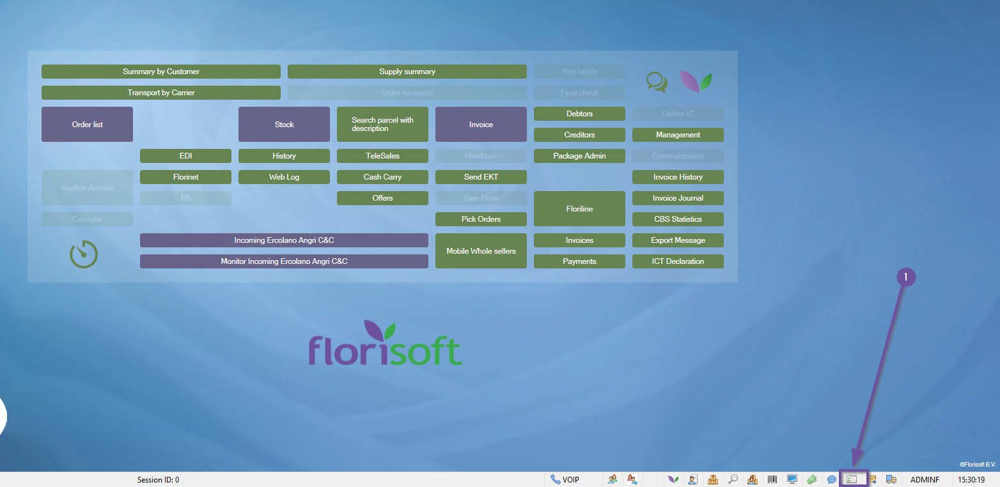
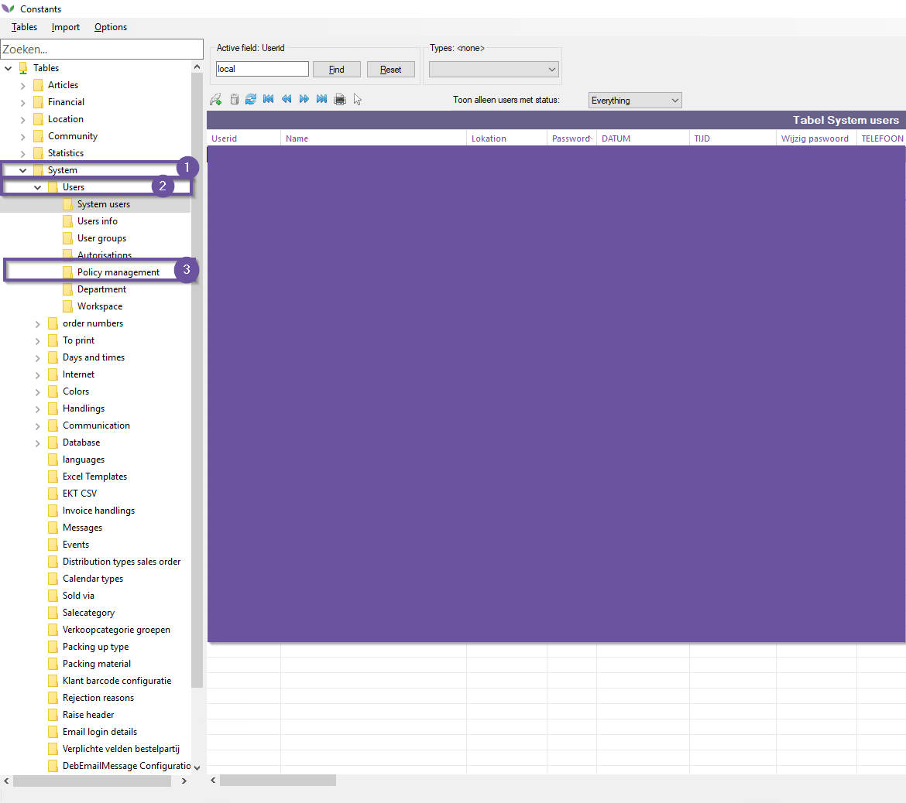
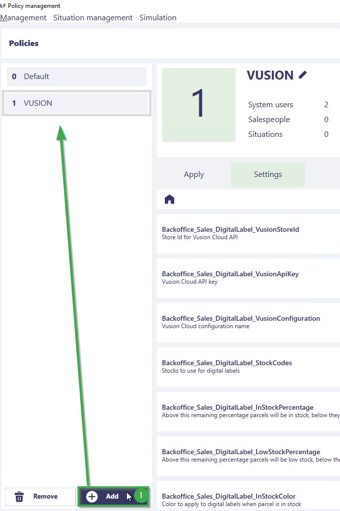
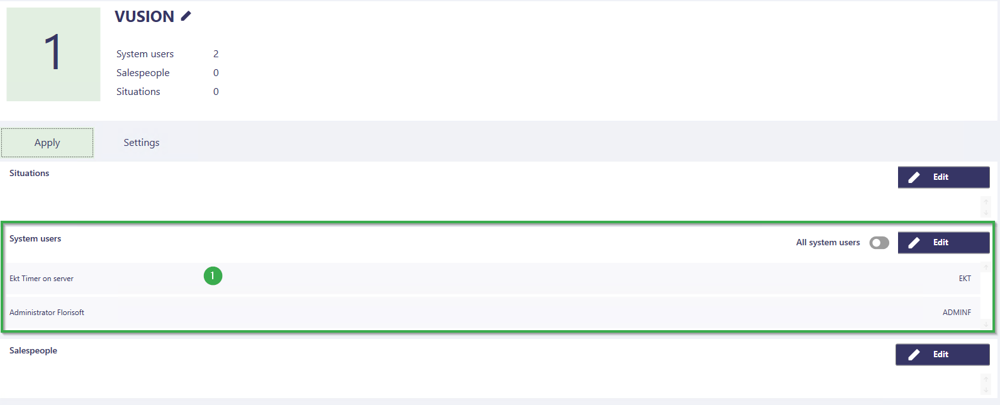
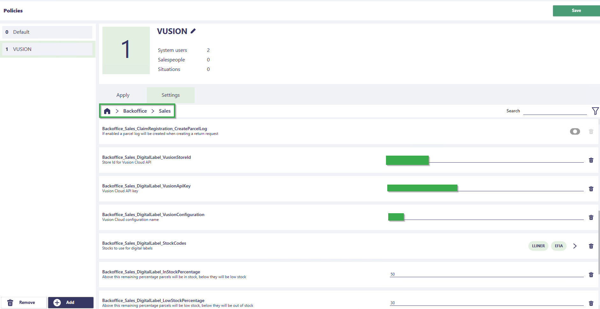
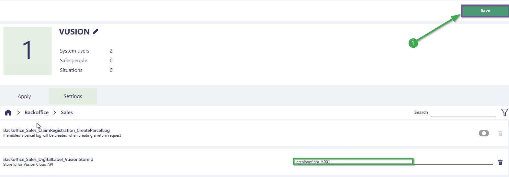
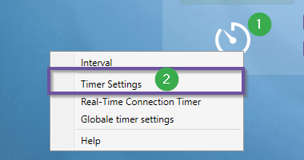
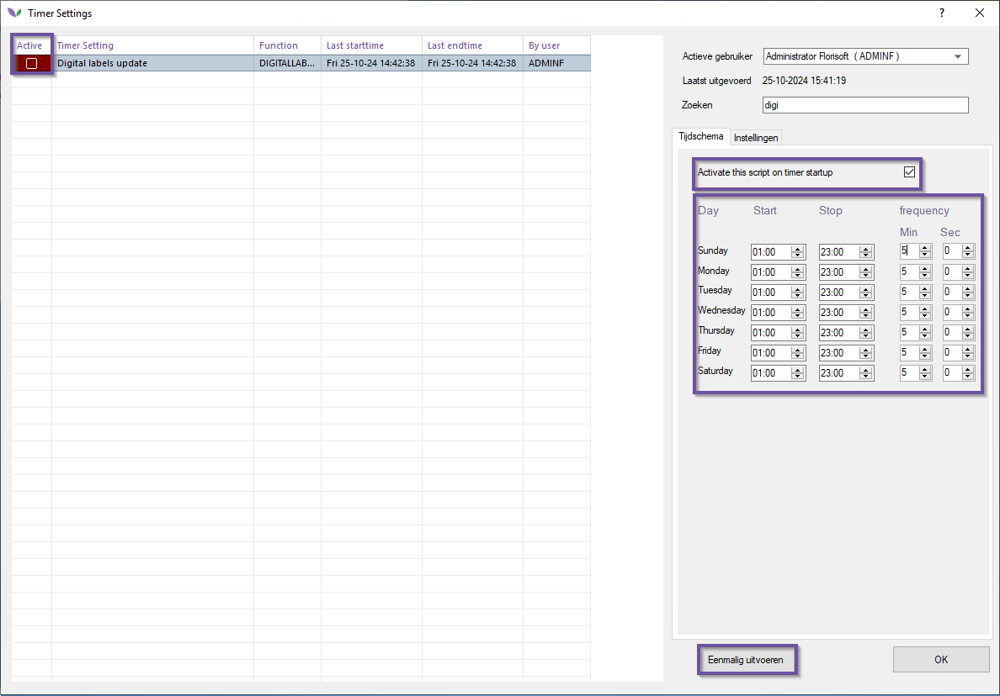

# Florisoft Manual Vusion Price Tag Management

[Vusion](https://www.vusion.com/solutions/sesimagotag/electronic-shelf-labels/) is an electronic shelf label (price tag) management system which can now be used in Florisoft Cash & Carries. 

Florisoft communicates to the Vusion label cloud using its APIs by sending it parcel information.
Vusion then handles the rest with regards to managing,styling and assigning parcels to the hardware labels. 

## Prerequisites 

Using this functionality requires you to have a subscription to the Vusion cloud and price tag hardware provided by Vusion.
Vusion would also need to set up the Vusion Cloud in such a way to receive the Parcel database fields sent by Florisoft. 

Florisoft sends the following fields from the Parcel database table :

|Database Value|Vusion Name|
|:--|:--|
|partij.partijnr|Id|
|partij.arttxt|Name|
|partij.inkprijs2|Price|
|partij.kwalcod|Quality|
|partij.s1|Length|
|-|Restcolor|

*Restcolor is the stock status which can be used to color the label depending on stocklevels.*

Make sure you have a recent Florisoft version, and the Vusion Cloud API credentials.
Required Vusion data :

- Vusion Store Id
- Vusion API Key
- Vusion Configuration Name

## Setup

Before we can send parcels to the Vusion Cloud we will need to configure some settings in order to authenticate to the Vusion cloud API. 

Follow the steps below :

|Step|Explanation|
|:-:|:--|
|**1**|From the Florisoft navigator navigate to the constants screen.

<b>Click here for the example image!</b>

|
|**2**|In the constants screen navigate to the Policy Management screen: **System→Users→Policy Management**

<b>Click here for the example image!</b>

|
|**3**|Create a new policy for the TIMER user, for more information on how to create and manage policies click [here](https://github.com/florisoft/User.Manuals/blob/main/BASIS/Policy%20Management/Manual%20Policy%20Management%20EN.md).

<b>Click here for the example image!</b>

|
|**4**|The policies for this module are under the folders **Backoffice→Sales** and are prefixed with **DigitalLabel**.

<b>Click here for the example image!</b>

|
|**5**|Set the **VusionStoreId** to the Vusion store Id for your location.|
|**6**|Set the **VusionApiKey** to the Vusion OCP-APIM-Subscription Key provided by Vusion.|
|**7**|Set the **VusionConfiguration** to the Vusion provided VusionConfiguration key.|
|**8**|Use the **Stockcodes** selection setting to configure which stock's parcels need to be sent to the Vusion cloud.|
|**9**|Now we have 5 remaining policy settings that decide when a parcel's stocklevel is "in-stock", "low-stock" ,"out of stock" and what colors correspond to said stocklevels.  **InStockPercentage** : *enter a numerical value which will be read as a percentage which decides when the stocklevel is considered to be "in-stock". If the parcels stock is calculated below said value, it will considered low-stocklevel.*  **LowStockPercentage** : *numerical value (percentage), which decides when he stocklevel is considered to be out of stock.*  **InStockColor**: *what color corresponds to the stocklevel "in stock".*  **LowStockColor**: *What color corresponds to the stocklevel "low stock".*  **OutOfStockColor**: *What color corresponds to the stocklevel "out of stock".*|
|**10**|Save the made changes using the **save** button.

<b>Click here for the example image!</b>

|
|**11**|We then need to log on to time timer user to configure the accompanying timer process.

<b>Click here for the example image!</b>

|
|**12**|Right click on the timer logo, and open timer settings.

<b>Click here for the example image!</b>

|
|**13**|Search for the timer process **Digital labels update**.

<b>Click here for the example image!</b>

|
|**14**|Activate the timer process and configure its timings.

<b>Click here for the example image!</b>

|
|**15**|When first testing the Florisoft->Vusion connection, click on the **eenmalig uitvoeren** button.

<b>Click here for the example image!</b>

|

Now log into your Vusion management cloud portal to see if the correct parcels have been sent over to Vusion.